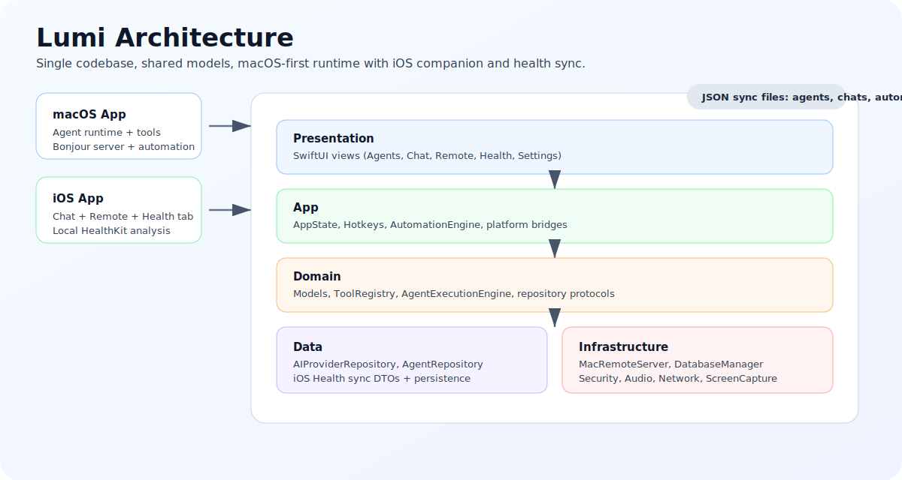
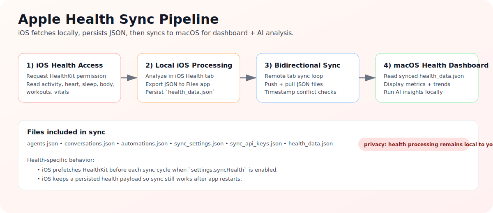

#  Lumi Agent

A macOS-first AI agent platform with an iOS companion for chat, remote control, and Apple Health sync.

Lumi can run tool-using agents that read/write files, execute shell commands, browse the web, control desktop input, and automate workflows. The iOS app pairs with your Mac over local network and now includes a dedicated Health tab with local analysis + JSON export.

^ Developed by Lumi Astria Fiona under TriadAstria™ Student Association.


---

## What’s New

- Added **iOS Health tab** (view + analyze local Apple Health metrics on iPhone)
- Added **local health JSON export** on iOS (`Documents/LumiAgent/health_data_*.json`)
- Added/confirmed sync of **`health_data.json`** between iOS and macOS
- Improved sync conflict checks for object-based payloads using `updatedAt`
- macOS Health view reads synced iPhone data and supports AI insight generation

---

## Product Map

| Area | macOS | iOS |
|---|---|---|
| Agents + Tool Execution | Full runtime (60+ tools) | Chat client (provider calls run on-device) |
| Desktop Control | Yes | Remote command client |
| Automation | Yes | No |
| Pairing/Remote | Bonjour TCP server + approval flow | Bonjour browser + remote panel |
| Health | Health dashboard (synced iPhone data + local fallback) | Health tab with local HealthKit analysis + JSON export |
| Voice | Mic + Whisper + TTS + realtime VAD | Mic + Whisper + TTS |

---

## Architecture



---

## Apple Health Sync Flow



---

## Screens

### Agent Workspace (macOS)


### Desktop/Automation UX (macOS)


### iOS Companion


---

## Core Capabilities

### 1) Agent Runtime
- Multi-agent setup with per-agent model/provider config
- Streaming agent loop (plan -> tool calls -> results -> continue)
- Tool registry with file, shell, web, git, clipboard, and system tools
- Security policy controls by agent (risk limits, tool allowlists, command restrictions)

### 2) macOS Integration
- Global hotkeys + floating command UI
- Text assist shortcuts (rewrite, grammar fix, instruction mode)
- macOS Services integration
- Automation triggers (schedule, app events, device conditions)

### 3) iOS Companion
- Agents, Chat, Remote, Health, Settings tabs
- Local-network pairing with Mac approval workflow
- Remote actions: sync, screenshot, shell command, volume control
- Continuous sync loop with conflict-aware timestamps

### 4) Health & Wellness
- iOS: local HealthKit fetch for activity, heart, body, sleep, workouts, vitals
- iOS: per-category local AI analysis and JSON export
- Sync file: `health_data.json`
- macOS: synced health dashboard + AI coaching summaries

### 5) Voice
- Push-to-talk transcription
- Realtime VAD pipeline on macOS
- Text-to-speech responses

---

## Safety Model

Lumi can perform high-impact actions depending on enabled tools and security settings.

Before enabling advanced capabilities, review:
- `Settings -> Security`
- Per-agent `enabledTools`
- Shell/desktop-control policies

Use least privilege for each agent profile.

---

## Requirements

- macOS 15.0+ (primary runtime)
- iOS 18.0+ (companion app)
- Swift 6.2 toolchain
- API key for at least one cloud model provider, or local Ollama

---

## Quick Start

### Option A: Native macOS run script
```bash
git clone https://github.com/triadastra/Lumi.git
cd Lumi
./run_app.sh
```

### Option B: Open in Xcode (iOS + macOS)
```bash
git clone https://github.com/triadastra/Lumi.git
cd Lumi
open Lumi.xcodeproj
```
Then run the macOS target and (optionally) the iOS companion target.

### Option C: Unsigned DMG build
```bash
./build_unsigned_dmg.sh
```

---

## First-Run Checklist

1. Add API keys in `Settings -> API Keys`
2. Grant required macOS permissions in `Settings -> Permissions`
3. Create your first agent and send a message in Agent Space
4. On iOS, pair in `Remote` tab and approve from Mac `Devices`
5. If using Health sync, enable `Settings -> Sync Apple Health` on iOS

---

## Health Setup (End-to-End)

1. On iPhone: open Lumi `Settings` and enable `Sync Apple Health`
2. Grant HealthKit read permissions when prompted
3. Open iOS `Health` tab and tap `Refresh`
4. (Optional) Tap `Export JSON` to save a local copy to Files
5. Connect to Mac in `Remote` tab and run `Sync Now`
6. On macOS: open `Health` sidebar to review synced metrics and AI insights

---

## Global Hotkeys

| Shortcut | Action |
|---|---|
| `⌘L` or `^L` | Open command palette |
| `⌥⌘L` | Open quick-action panel |
| `⌥⌘E` | Extend selected text with AI |
| `⌥⌘G` | Grammar-fix selected text |
| `⌥⌘R` | Treat selection as an instruction |
| `⌘,` | Open Settings |
| `⌘N` | New agent |

---

## Project Structure

```text
Lumi/
├── App/              # App entry, AppState, hotkeys, automation
├── Domain/           # Models, protocols, tool registry, execution engine
├── Data/             # Repositories, provider integration, iOS health sync DTOs
├── Infrastructure/   # Database, network, security, audio, screen capture
└── Presentation/     # SwiftUI views (Agents, Chat, Remote, Health, Settings)
```

---

## Documentation

Project docs are in [wiki/](wiki/):

- [Getting Started](wiki/Getting-Started.md)
- [Architecture](wiki/Architecture.md)
- [Agents and Configuration](wiki/Agents-and-Configuration.md)
- [AI Providers](wiki/AI-Providers.md)
- [Tool Catalog](wiki/Tool-Catalog.md)
- [Desktop Control and Agent Mode](wiki/Desktop-Control-and-Agent-Mode.md)
- [Hotkeys and Quick Actions](wiki/Hotkeys-and-Quick-Actions.md)
- [iOS Companion](wiki/iOS-Companion.md)
- [Automation](wiki/Automation.md)
- [Voice](wiki/Voice.md)
- [Security and Permissions](wiki/Security-and-Permissions.md)
- [Building and Deployment](wiki/Building-and-Deployment.md)
- [Troubleshooting](wiki/Troubleshooting.md)
- [Function Reference](wiki/Function-Reference.md)
- [Function Updates](wiki/Function-Updates.md)

---

## Contributing

PRs are welcome. Keep changes scoped and include validation steps.

## License

See [LICENSE](LICENSE).
